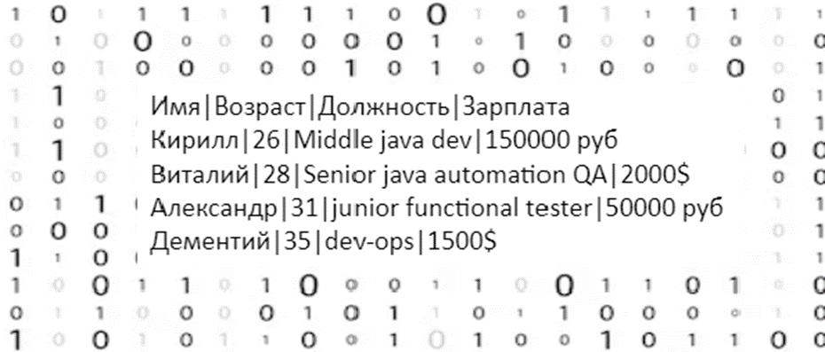
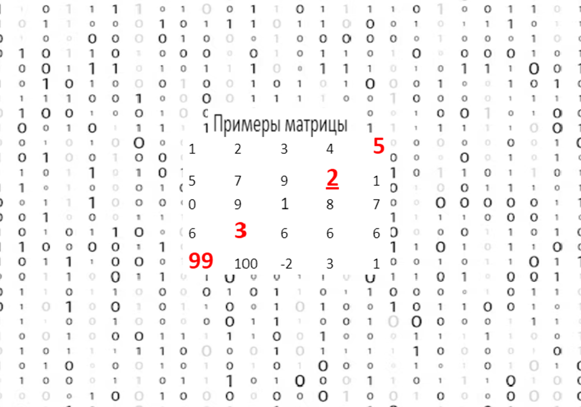
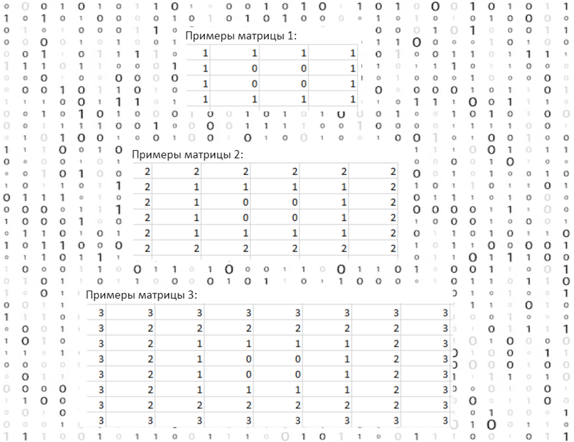
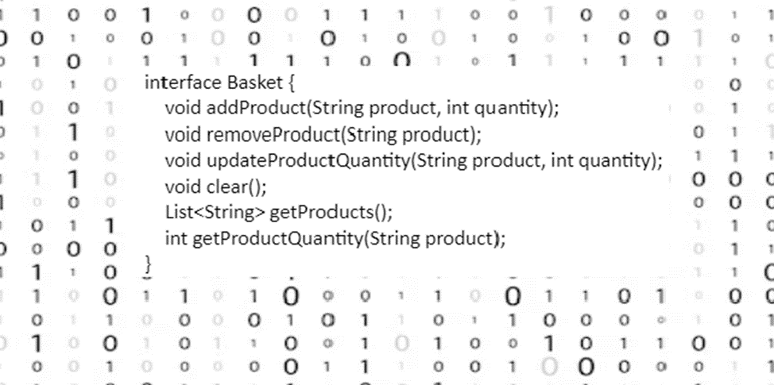

# Тестовое задание
## Вакансия: Junior Java-разработчик
## Компания: Bellintegrator
### Задача 1
Дана таблица:

Данная таблица представлена в формате
List<Map<String,String>>, где каждый элемент list - строка, key в map - название столбца, value в map - значение ячейки

Задача:
- вывести имена всех сотрудников, младше 30.
- вывести имена всех сотрудников, получающих зарплату в рублях.
- вывести средний возраст всех сотрудников.

решение на Java
будет плюсом использование stream API

### Задача 2
Дан массив NxN. Напишите программу на Java которая находит минимальный элемент диагонали на картинке, без учёта элемента пересечения диагоналей.

### Задача 3
Создать алгоритм заполнения матрицы согласно схемам, приведенным ниже:

### Задача 4
Реализовать класс корзины интернет-магазина по следующему интерфейсу:

